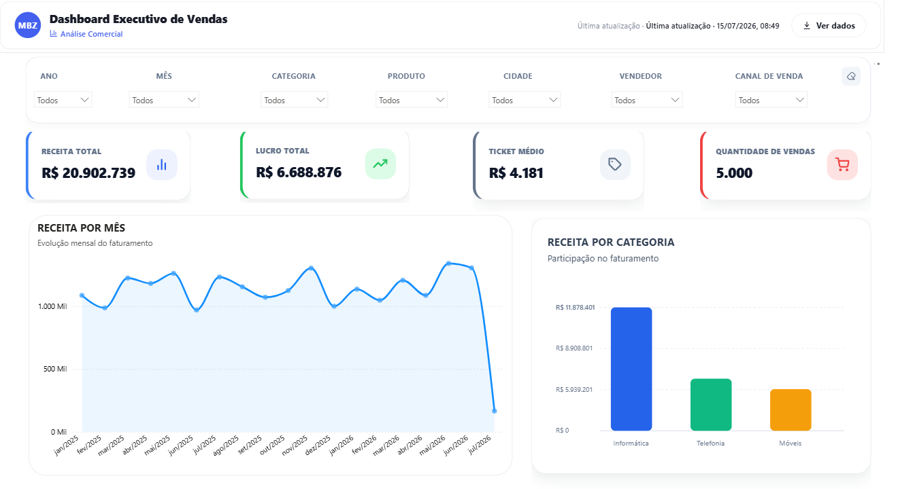
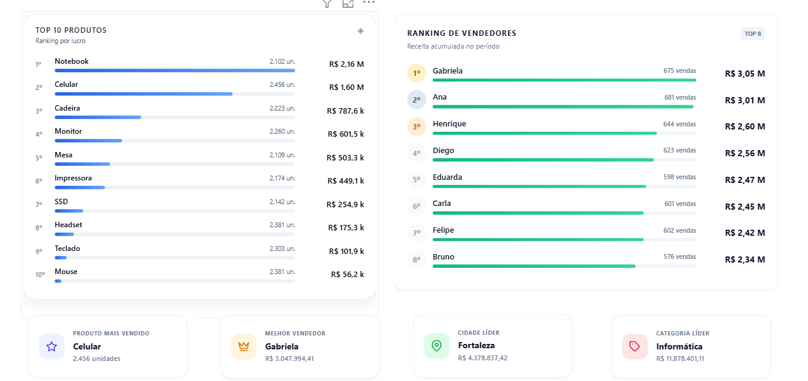
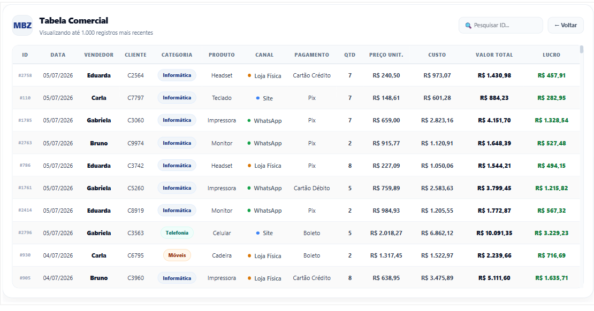

# Análise de Vendas com Python e Power BI

Projeto de análise comercial desenvolvido para demonstrar um fluxo completo de dados, desde o tratamento da base com Python até a construção de um dashboard interativo no Power BI.

## Objetivo

Transformar uma base fictícia de vendas em informações úteis para acompanhamento comercial, aplicando tratamento de dados, criação de indicadores e visualização no Power BI.

## Dashboard

### Página 1 — Visão geral



### Página 2 — Análise comercial



### Página 3 — Detalhamento dos dados



## Tecnologias utilizadas

- Python
- Pandas
- Excel
- Power BI
- Power Query
- DAX
- HTML

## Processo de tratamento

O script `src/tratamento.py` realiza:

- leitura da base em Excel;
- inspeção da estrutura dos dados;
- identificação de valores nulos;
- remoção de registros duplicados;
- conversão e validação de datas;
- criação de colunas temporais;
- cálculo de custo, lucro e margem;
- classificação das vendas;
- exportação da base tratada.

## Indicadores desenvolvidos

- Receita total
- Custo total
- Lucro
- Margem de lucro
- Ticket médio
- Quantidade de vendas
- Desempenho por categoria
- Ranking de produtos
- Ranking de vendedores
- Análise por cidade

## Estrutura do projeto

```text
analise-vendas-power-bi/
├── dashboard/
├── data/
├── images/
│   ├── dashboard_pagina_1.png
│   ├── dashboard_pagina_2.png
│   └── dashboard_pagina_3.png
├── src/
│   └── tratamento.py
├── .gitignore
├── README.md
└── requirements.txt
```

## Como executar

Instale as dependências:

```bash
pip install -r requirements.txt
```

Execute o tratamento dos dados:

```bash
python src/tratamento.py
```

## Autor

**Pedro Davi Monteiro**

Estudante de Ciência de Dados, com interesse em análise de dados, Business Intelligence, automação e desenvolvimento de soluções orientadas a dados.